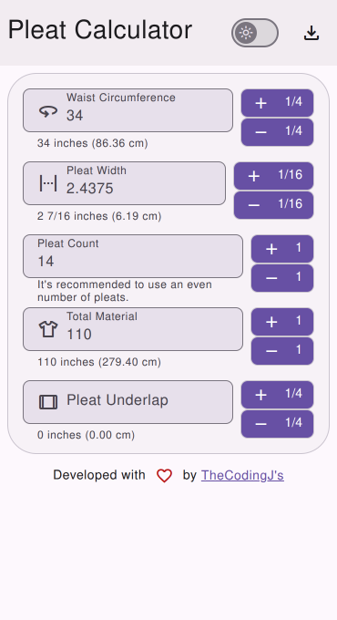

# Pleat Calculator

A handy app for calculating pleats with precision and style.

## Demo



## Development

### Prerequisites

- [Node.js](https://nodejs.org/en/)
- [Firebase account](https://firebase.google.com/)

### Installation

```bash
npm install
```

### Build

```bash
npm run build
```

### Publish

```bash
firebase deploy
```

## License

[GPL-3.0](LICENSE)
