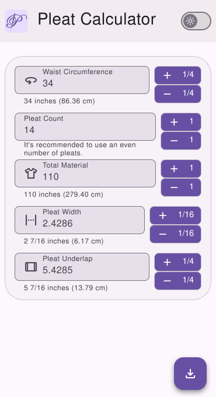

# Pleat Calculator

A handy app for calculating pleats with precision and style.

## Demo




## Development

### Prerequisites

- [Node.js](https://nodejs.org/en/)
- [Firebase CLI](https://firebase.google.com/docs/cli)
- A [Firebase project](https://console.firebase.google.com/)

### Installation

Clone the repository and install dependencies:

```bash
npm install
```

### Local Development

To start a development server with hot reload:

```bash
npm run dev
```

### Build for Production

```bash
npm run build
```

### Deploy to Firebase

Make sure you're logged in (`firebase login`) and have initialized Firebase (`firebase init`). Then run:

```bash
firebase deploy
```

## License

[GPL-3.0](LICENSE)
